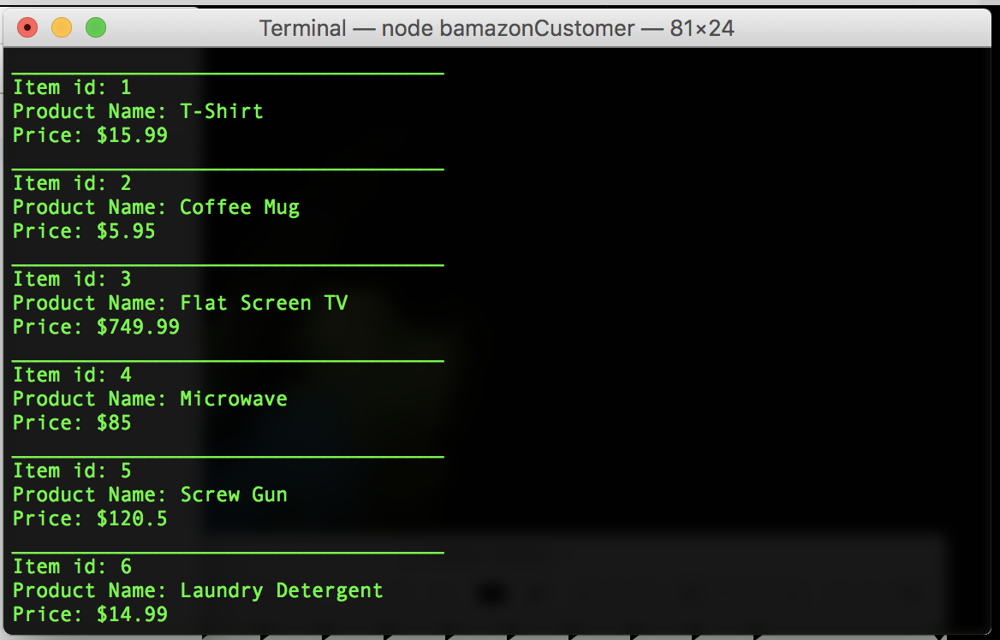
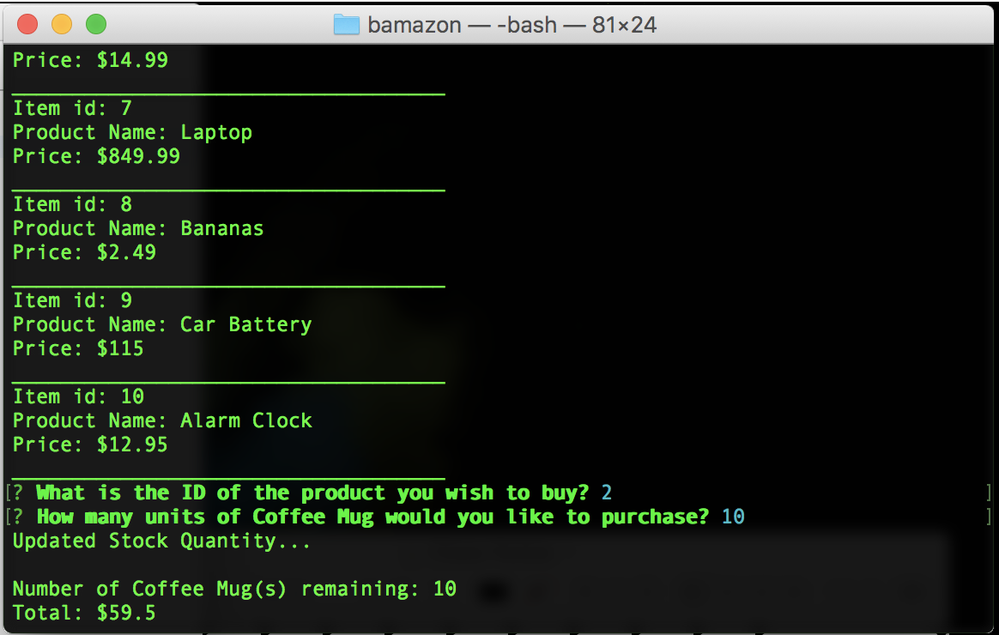
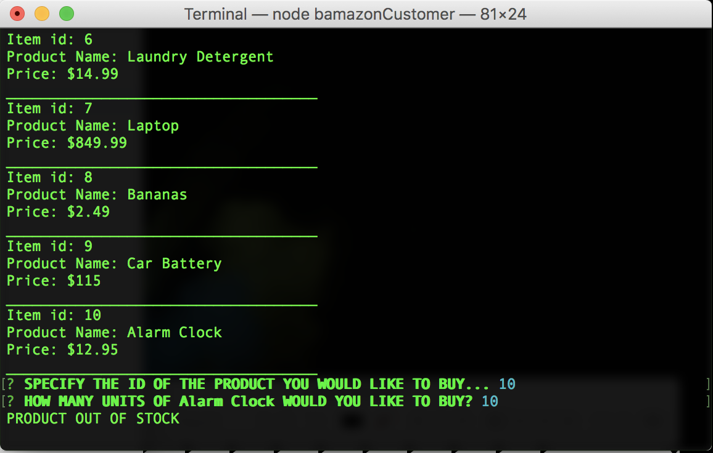

# bamazon

- The node app first logs the product's info to the console
---- Item ID
---- Product Name
---- Price

- It then prompts the user to specify what product they would like to purchase via Item ID
- This is followed by a prompt asking the user to specify how man units of the product they would like

---- If the store has enough in stock to fulfill the order we display the total cost of the order to the user and display the total number of units left in stock

---- If the store does not have enough in stock to fulfill the order we inform the user that the item is out of stock.

